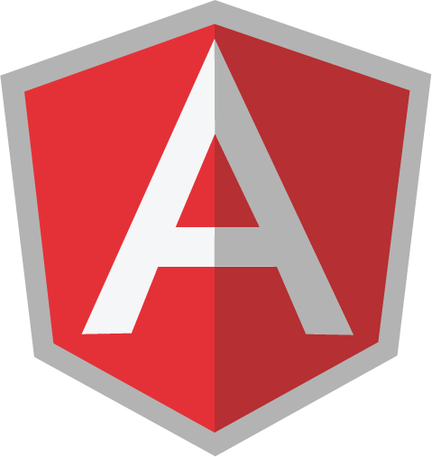

# Computer Scientist Student

---

## General Information

- Address: Nea Makri, 19005, Attica, Greece
- Email:
  - [nikolasil2000@gmail.com](mailto:nikolasil2000@gmail.com)
  - [nikolasil@yahoo.gr](mailto:nikolasil@yahoo.gr)
  - [iliopoulos.info@gmail.com](mailto:iliopoulos.info@gmail.com)
- Phone: +30 694 294 88 51
- Birthday: 18.11.2000
-  [LinkedIn](https://www.linkedin.com/in/nikolasiliopoulos)
-  [GitHub](https://github.com/nikolasil)

---

## Studies

- Student at [National and Kapodistrian University of Athens](https://www.di.uoa.gr/) (UOA).
  - Department of Informatics and Telecomunications
  - Time Period: 2018 - Today

- Highschool Graduate
  - 1st Nea Makri General Highschool
  - Time Period: 2013 - 2018
  - Grade: 18.3/20

---

## Languages

My native language is **Greek**.

Second Languages:
- English (B2 Lower Michigan)

> I studied German when I was young. I can **only** do a brief conversation.

---

## Programming Languages

-  C
-  C++
-  Python

> Still Learning | Basic Knowledge:
> -  Dart
> -  Javascript
> -  Java

> Little Experience:
> -  Bash
> -  Assembly

---

## Frameworks

-  Flutter

> Still Learning | Basic Knowledge:
> -  Node.js
>   - RestFul API
> -  Angular.js

---

## Other Skills

-  HTML &  CSS
  - Little Experience
- SQL & NoSQL Databases
  -  MySQL
    > Still Learning Basic Knowledge
  -  MongoDB
    > Little Experience
- CNC
  - Work experience with 3-axis plasma cutter
  -  Camduct
  -  Mach3
-  Photoshop
-  Corel
-  Matlab
- 
-  Version Control Git
- Microsoft Office
  - VBA

---

## Work Εxperience

- **Creation & maintenance of android application.**
It is an innovative application that enables the user to find the air conditioner error code and provides helpfull tips to repear it.
The application was created for the needs of the company [ALTEMCO AE](https://www.altemco.gr/).
  > - Application Name: ALTEMCO HVAC
  > - Made with MIT App Inventor, then changed to Kodular and future goal is to recreate it with Flutter
  > - [Google Play Store](https://play.google.com/store/apps/details?id=appinventor.ai_nikolasil2000.hvac2)
  > - Time Period: 2014 – Today

- **Maintenance of E-Shop.**
I created the products [attributes, filters, prices, photos, descriptions].
The eshop belongs to [ALTEMCO AE](https://www.altemco.gr/).
  > - Made with OpenCart
  > - [Eshop](https://www.eshop.altemco.gr/)
  > - Time Period: 2020 – Today

### Jobs outside my field

- **Maintenance of CNC** for the company [ALTEMCO AE](https://www.altemco.gr/).
I made all the specifications and settings in CamDuct to increase the workflow, productivity and waste of material.
I am responsible to repair every problem that occurs related to the machine or the generating g-code from CamDuct or with the connectivity between the machine and Mach3.
  > - Type: Plasma Cutter
  > - Dimensions: 3000mm × 2500mm
  > - Program: Mach3
  > - G-Code Program: CamDuct
  > - Time Period: 2019 - Today

- **HVAC Service** [ALTEMCO AE](https://www.altemco.gr/).
Daily services and maintainace of HVAC Systems.
  > - Time Period: June 2019 – September 2019

---

## Projects

- **Berkeley Pacman Artificial Inteligence Projects.**
These projects were made during my studies in UOA University and especially for the course [Artificial Intelligence 1](https://www.di.uoa.gr/studies/undergraduate/118).
  >   Github Repositories:
  > - [Project 0](https://github.com/nikolasil/Berkeley-Pacman-Project-0)
  > - [Project 1](https://github.com/nikolasil/Berkeley-Pacman-Project-1)
  > - [Project 2](https://github.com/nikolasil/Berkeley-Pacman-Project-2)

---

## Volunteering

- Various reforestations in Attica.
- Voluntary work: Helping fire victims in Mati from the fire on 23.07.2018.
  > Time Period: July 2018 - September 2018

---

## Hobbies | Interests | Passions

- Data Structures
- Algorithms & Problem Solving
- PC Building
- Latest technologies & Innovations
- Universe, Space & Physics
-  Android Development
-  Arduino
-  Raspberry Pi
-  Tennis
