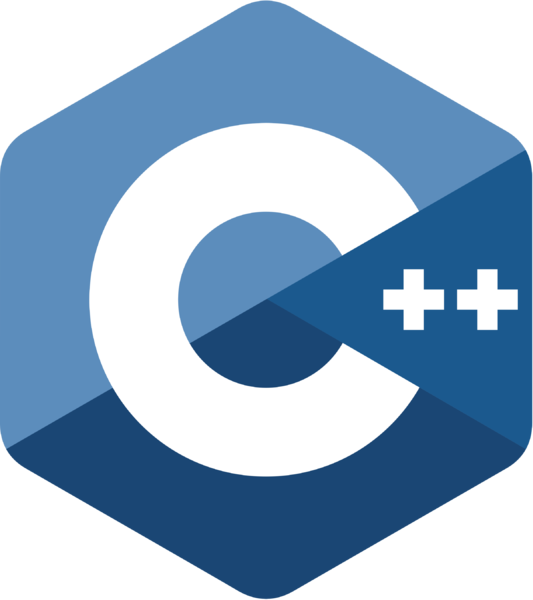
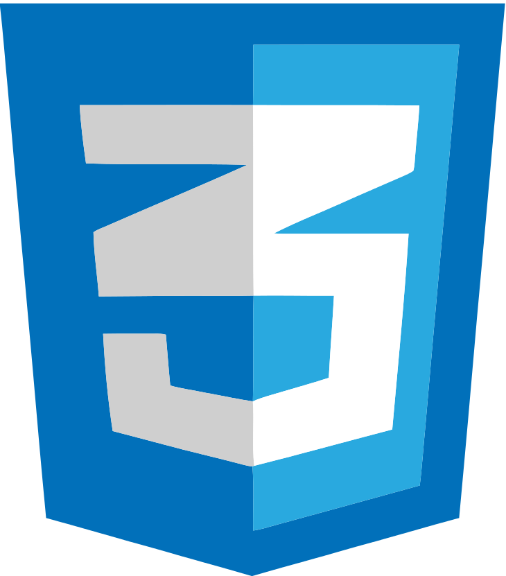
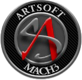
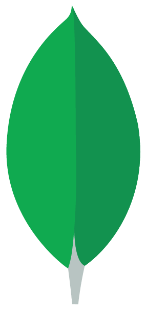

# Computer Scientist Student

---

## General Information

- Address: Nea Makri, 19005, Attica, Greece
- Email: [iliopoulos.info@gmail.com](mailto:iliopoulos.info@gmail.com)
- Phone: +30 694 294 88 51
- Birthday: 18.11.2000
- 

 

 <a href="https://github.com/nikolasil">GitHub</a> 

 
- 

 

 <a href="https://www.linkedin.com/in/nikolasiliopoulos">LinkedIn</a> 

---

## Studies

- Student at [National and Kapodistrian University of Athens](https://www.di.uoa.gr/) (UOA).
  - Department of Informatics and Telecomunications
  - Time Period: 2018 - Today

- Highschool Graduate
  - 1st General Highschool of Nea Makri
  - Time Period: 2015 - 2018
  - Grade: 18.3/20

---

## Languages

My native language is **Greek**.

Second Languages:
- English (B2 Lower Michigan)

---

## Programming Languages

- 

 

 C 

- 

 

 C++ 

- 

 

 Python 

- 

 

 Java 

> Still Learning | Basic Knowledge:
> - 

 

 Dart 

> - 

 

 Javascript 

> - 

 

 Bash 

> - 

&nbsp; 

 Assembly 

---

## Frameworks

> Still Learning | Basic Knowledge:
> - 

 

 Flutter 

> - 

 

 Node.js

---

## Other Skills

- 

 

 Version Control GIT 

- 

 

- Microsoft Office
  - VBA
- 

 

 Adobe Photoshop 

- 

 

 HTML & 

&nbsp;&nbsp;&nbsp;&nbsp;&nbsp;&nbsp;&nbsp;&nbsp;&nbsp;&nbsp;&nbsp;&nbsp;&nbsp;&nbsp;&nbsp;&nbsp;&nbsp;&nbsp;&nbsp;&nbsp;&nbsp;&nbsp;&nbsp; 
 
 &nbsp;&nbsp;&nbsp;&nbsp;&nbsp;&nbsp;&nbsp;&nbsp;&nbsp;&nbsp;&nbsp;&nbsp;&nbsp;&nbsp;&nbsp;&nbsp;&nbsp;&nbsp;&nbsp;&nbsp;&nbsp;&nbsp;CSS 

> Still Learning | Basic Knowledge:
> - 

 

 Android Studio 

> - 

 

  MySQL 

> - CNC
>   - Experience with 3-Axis Plasma Cutter
>   - 

 

 CamDuct 

>   - 

 

 Mach3 

> - 

 

 MatLab 

> Little Experience:
> - 

&nbsp; 

 MongoDB 

> - 

 

 CorelDRAW 

---

## Work Εxperience

- **Creation & maintenance of android application.**
It is an innovative application that enables the user to find the air conditioner error code and provides helpful tips to repear it.
The application was created for the needs of the company [ALTEMCO SA](https://www.altemco.gr/).
  > - Application Name: ALTEMCO HVAC
  > - Made with MIT App Inventor, then changed to Kodular and future goal is to recreate it with Flutter
  > - [Google Play Store](https://play.google.com/store/apps/details?id=appinventor.ai_nikolasil2000.hvac2)
  > - Rating: 4.6
  > - Reviews: 105
  > - Total Installs: 5.000
  > - Monthly Active Users: 2.500
  > - Time Period: 2014 – Today

- **Maintenance of E-Shop.**
The eshop belongs to [ALTEMCO SA](https://www.altemco.gr/).
  > - Made with OpenCart
  > - [Eshop](https://www.eshop.altemco.gr/)
  > - Time Period: 2020 – Today

### Jobs outside my field

- **Maintenance of CNC** for the company [ALTEMCO SA](https://www.altemco.gr/).
Specifications and settings in CamDuct to increase the workflow, productivity and material waste.
I am responsible to repair every problem that occurs related to CNC or generating g-code from CamDuct and the connectivity between the machine and Mach3
  > - Type: Plasma Cutter
  > - Dimensions: 3000mm × 2500mm
  > - Program: Mach3
  > - G-Code Program: Fabrication CamDuct
  > - Time Period: 2019 - Today

- **HVAC Service** [ALTEMCO SA](https://www.altemco.gr/).
Daily services and maintenance of HVAC Systems.
  > - Time Period: June 2019 – September 2019

---

## Projects

- **Berkeley Pacman Artificial Intelligence Projects.**
These projects were made during my studies in UOA University and especially for the course [Artificial Intelligence 1](https://www.di.uoa.gr/studies/undergraduate/118).
  >   Github Repositories:
  > - [Project 0](https://github.com/nikolasil/Berkeley-Pacman-Project-0)
  > - [Project 1](https://github.com/nikolasil/Berkeley-Pacman-Project-1)
  > - [Project 2](https://github.com/nikolasil/Berkeley-Pacman-Project-2)

---

## Volunteering

- Various reforestations in Attica.
- Voluntary work: Helping fire victims in Mati from the fire on 23.07.2018.
  > - Time Period: July 2018 - September 2018

---

## Hobbies | Interests | Passions

- 

 

 Tennis 

- Data Structures
- Algorithms & Problem Solving
- 

 

 Android Development 

- PC Building
- Latest technologies & Innovations
- Universe, Space & Physics
- 

 

 Arduino 

- 

 

 Raspberry Pi 

